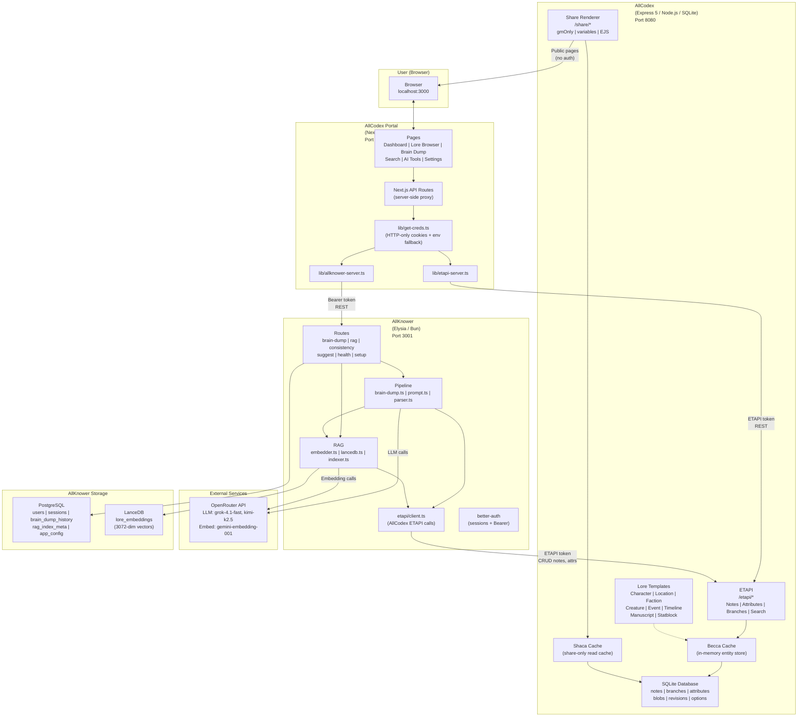
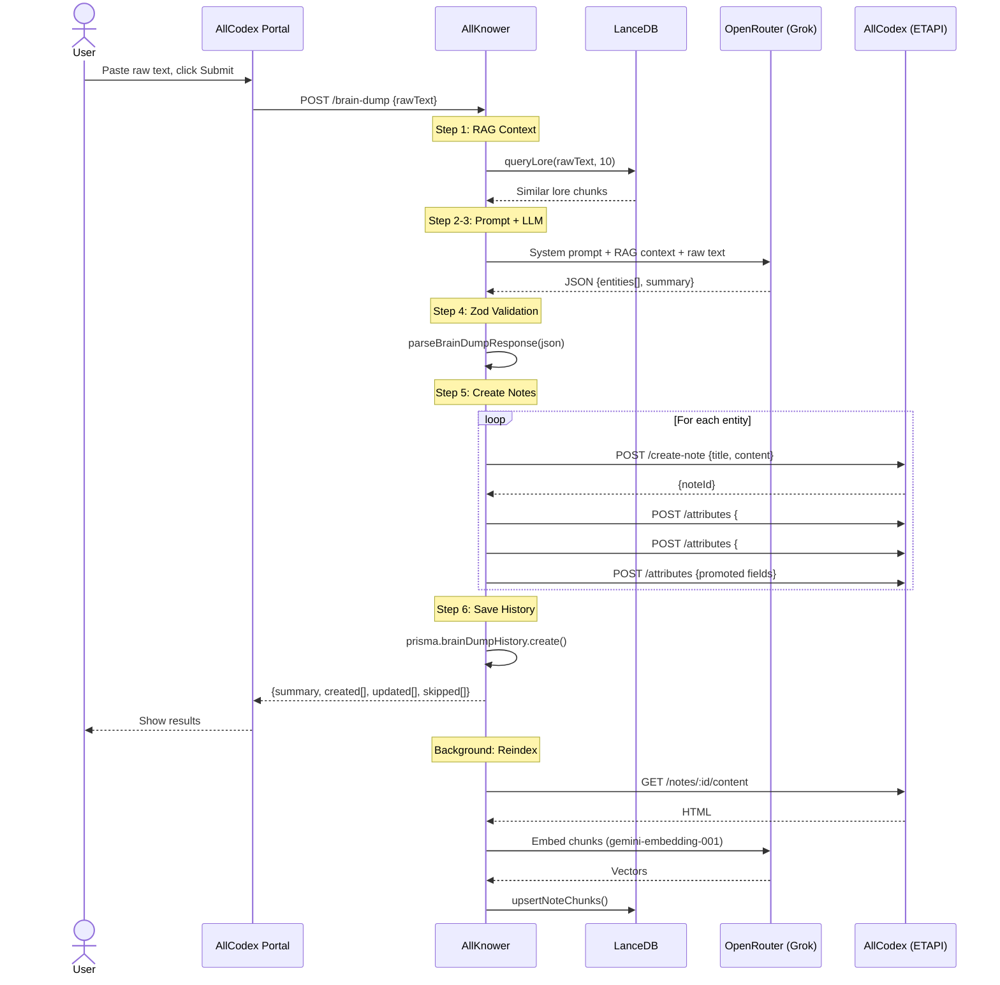

# AllCodex Ecosystem: Full Architecture Documentation

> A detailed breakdown of how AllCodex, AllKnower, and the AllCodex Portal work together to power the All Reach grimoire.

---

## Table of Contents

1. [System Overview](#1-system-overview)
2. [AllCodex (The Database)](#2-allcodex-the-database)
3. [AllKnower (The Brain)](#3-allknower-the-brain)
4. [AllCodex Portal (The Interface)](#4-allcodex-portal-the-interface)
5. [Data Flow: Brain Dump Pipeline](#5-data-flow-brain-dump-pipeline)
6. [Data Flow: Lore Browsing](#6-data-flow-lore-browsing)
7. [Data Flow: AI Analysis Tools](#7-data-flow-ai-analysis-tools)
8. [Data Flow: RAG Indexing](#8-data-flow-rag-indexing)
9. [Data Flow: Public Share Pages](#9-data-flow-public-share-pages)
10. [Authentication and Credentials](#10-authentication-and-credentials)
11. [AllCodex Internals: How Trilium Works](#11-allcodex-internals-how-trilium-works)
12. [AllCodex Customizations](#12-allcodex-customizations)
13. [AllKnower Internals](#13-allknower-internals)
14. [Portal Internals](#14-portal-internals)
15. [Mermaid Diagram](#15-mermaid-diagram)

---

## 1. System Overview

The ecosystem is three services:

| Service | Repo | Stack | Port | Role |
|---|---|---|---|---|
| **AllCodex** | `AllCodex/` | Node.js, Express 5, SQLite, EJS | 8080 | Lore database. Stores every note, attribute, and relation. Serves ETAPI and public share pages. |
| **AllKnower** | `AllKnower/` | Bun, Elysia, PostgreSQL, LanceDB | 3001 | AI orchestrator. Runs brain dumps, embeddings, consistency checks, relationship suggestions, gap detection. |
| **AllCodex Portal** | `AllCodex-Portal/` | Next.js 16, React 19, TanStack Query, shadcn/ui | 3000 | Web frontend. The user never touches AllCodex or AllKnower directly; the Portal is the single interface. |

Communication is unidirectional for data writes:

```
User -> Portal -> AllKnower -> AllCodex (for brain dumps)
User -> Portal -> AllCodex   (for direct CRUD)
User -> Portal -> AllKnower  (for AI analysis)
```

AllCodex never calls AllKnower. AllKnower calls AllCodex (via ETAPI) to read and write notes. The Portal calls both backends through its own Next.js API routes (server-side only, never from the browser).

---

## 2. AllCodex (The Database)

### What it is

A server-only fork of TriliumNext/Trilium v0.101.3. The original desktop client, Electron app, and web clipper have been removed. What remains:

- The Express 5 HTTP server
- SQLite database (via better-sqlite3)
- ETAPI (the external REST API)
- The share system (public page rendering)
- The hidden subtree (built-in system notes)
- The search engine (full-text + attribute queries)

### How it stores data

Everything is a **note**. Notes have:

| Field | Description |
|---|---|
| `noteId` | Unique alphanumeric ID |
| `title` | Display name |
| `type` | `text`, `code`, `file`, `image`, `search`, `book`, `noteMap`, `webView`, `mermaid` |
| `mime` | MIME type (`text/html` for text notes) |
| `isProtected` | Encrypted at rest, requires password to view |
| `dateCreated` / `dateModified` | Timestamps |

Content (the HTML body) is stored separately in a `blobs` table joined by `blobId`.

### How notes relate to each other

Notes are organized in a **tree** via **branches**. A branch links a parent note to a child note with a position number. A single note can have multiple parents (multi-parent tree, not a strict hierarchy).

**Attributes** attach metadata to notes:

| Attribute type | What it does |
|---|---|
| `label` | Key-value pair on a note. Example: `#loreType = "character"` |
| `relation` | Points from one note to another. Example: `~template = "_template_character"` |

Labels can be **promoted** (displayed as a structured form at the top of a note) or inheritable (automatically applied to child notes).

### ETAPI endpoints

AllCodex exposes a REST API under `/etapi/`:

| Method | Path | Description |
|---|---|---|
| `POST` | `/create-note` | Create a note and place it in the tree |
| `GET` | `/notes?search=...` | Full-text and attribute search |
| `GET` | `/notes/:id` | Get note metadata and attributes |
| `GET/PUT` | `/notes/:id/content` | Read/write the HTML body |
| `PATCH` | `/notes/:id` | Update title, type, mime |
| `DELETE` | `/notes/:id` | Delete a note |
| `POST` | `/attributes` | Create a label or relation |
| `PATCH/DELETE` | `/attributes/:id` | Update or remove an attribute |
| `POST` | `/branches` | Create a parent-child link |
| `GET` | `/app-info` | Server version and status |

Auth: token-based. Create an ETAPI token in AllCodex Options. Pass it in the `Authorization` header on every request.

Interactive API docs are served at `/docs` (Scalar UI). The OpenAPI spec is at `/etapi/openapi.json`.

### Cache layers

AllCodex has two in-memory caches:

1. **Becca** (Backend Cache): the primary data layer. All notes, branches, attributes, and revisions are loaded into memory on startup. Every write goes to both SQLite and Becca. All reads come from Becca, never from disk. This is why AllCodex is fast even for large databases.

2. **Shaca** (Share Cache): a lightweight read-only cache for public shared notes. Only notes under the `#shareRoot` subtree are loaded. The share page renderer reads from Shaca.

### Search engine

AllCodex search supports:

- Full-text: `"towers tolkien"` (quotes for phrases)
- Label filters: `#loreType=character`, `#status=alive`
- Relation filters: `~template = "_template_character"`
- Logical operators: `AND`, `OR`, `NOT`
- Ordering: `orderBy:dateModified`

The search engine lives in `apps/server/src/services/search/`. It parses query strings into expression trees, evaluates them against Becca, and returns scored results.

---

## 3. AllKnower (The Brain)

### What it is

An Elysia server running on Bun. It provides AI-powered features that AllCodex cannot do on its own:

- **Brain Dump Pipeline**: raw text in, structured lore notes out
- **RAG System**: vector embeddings of all lore for semantic search
- **Consistency Checker**: finds contradictions across the grimoire
- **Relationship Suggester**: recommends connections between entities
- **Gap Detector**: identifies underdeveloped areas
- **Lore Autocomplete**: instant title suggestions

### How it stores data

AllKnower uses two databases:

1. **PostgreSQL** (via Prisma): stores user accounts, session tokens, brain dump history, RAG index metadata, and app config.

2. **LanceDB** (embedded, on-disk): stores vector embeddings of all lore chunks. No separate server needed; LanceDB runs in-process.

### Models used

All LLM and embedding calls go through OpenRouter:

| Task | Model | Purpose |
|---|---|---|
| Brain Dump | `x-ai/grok-4.1-fast` | Entity extraction from raw text |
| Consistency Check | `moonshotai/kimi-k2.5` | Contradiction detection |
| Relationship Suggestions | `x-ai/grok-4.1-fast` | Connection proposals |
| Gap Detection | `x-ai/grok-4.1-fast` | Coverage analysis |
| Embeddings | `google/gemini-embedding-001` | 3072-dim vectors for semantic search |

### AllKnower API routes

| Method | Path | Description |
|---|---|---|
| `POST` | `/brain-dump` | Run the full extraction pipeline |
| `GET` | `/brain-dump/history` | Recent brain dump log |
| `POST` | `/rag/query` | Semantic similarity search |
| `POST` | `/rag/reindex/:noteId` | Reindex one note |
| `POST` | `/rag/reindex` | Full corpus reindex |
| `GET` | `/rag/status` | Index stats |
| `POST` | `/consistency/check` | Run consistency scan |
| `POST` | `/suggest/relationships` | Suggest connections |
| `GET` | `/suggest/gaps` | Detect lore gaps |
| `GET` | `/suggest/autocomplete?q=...` | Title autocomplete |
| `POST` | `/setup/seed-templates` | Create lore templates in AllCodex |
| `GET` | `/health` | Service health (AllCodex, Postgres, LanceDB) |

Auth: better-auth sessions (Bearer token). Users register/login via the Portal settings page.

---

## 4. AllCodex Portal (The Interface)

### What it is

A Next.js 16 app with React 19. It is the only thing the user interacts with. The Portal never exposes AllCodex or AllKnower credentials to the browser; all backend calls happen server-side in Next.js API routes.

### Stack

| Layer | Tech |
|---|---|
| Framework | Next.js 16 (App Router) |
| React | 19 with React Compiler |
| Data fetching | TanStack Query (30s stale time, 1 retry) |
| State | Zustand (minimal global state) |
| UI components | shadcn/ui (Radix primitives + Tailwind) |
| Dark theme | Cinzel (headings) + Crimson Text (body) fonts |
| Drawer/sheets | Vaul |

### Pages

| Route | Page | Description |
|---|---|---|
| `/` | Dashboard | Stat cards, recent entries grid, quick actions, system status |
| `/lore` | Lore Browser | Filterable grid of all lore entries. Tabs by type (Character, Location, Faction, etc.) |
| `/lore/new` | New Entry | Title, type dropdown, optional parent, initial content |
| `/lore/[id]` | Note Detail | Two-column: content + sidebar with labels and relations. "Suggest Connections" button. |
| `/lore/[id]/edit` | Edit Note | Title, HTML content textarea, delete with confirmation |
| `/brain-dump` | Brain Dump | Textarea for raw text. Shows results (created/updated entities) + history |
| `/search` | Search | Dual-mode: Semantic (RAG via AllKnower) or Attribute (ETAPI query via AllCodex) |
| `/ai/consistency` | Consistency | Optional note IDs input. Runs scan, shows issues by severity |
| `/ai/gaps` | Gap Detector | One-click scan. Shows gaps grouped by severity with suggestions |
| `/ai/relationships` | Relationships | Text input. Shows suggested connections with type badges |
| `/settings` | Settings | Two cards: AllCodex connection (token or password) + AllKnower connection (token or sign-in) |

### How the Portal talks to backends

The Portal's API routes (`app/api/`) act as a secure proxy:

```
Browser  ->  Next.js API Route (server-side)  ->  AllCodex ETAPI
                                               ->  AllKnower API
```

Credentials are stored in HTTP-only cookies (set via `/api/config/connect`) or fall back to environment variables in `.env.local`. The browser never sees ETAPI tokens or AllKnower Bearer tokens.

Two server-side client libraries handle the calls:
- `lib/etapi-server.ts`: wraps AllCodex ETAPI (searchNotes, getNote, createNote, etc.)
- `lib/allknower-server.ts`: wraps AllKnower API (runBrainDump, checkConsistency, etc.)

---

## 5. Data Flow: Brain Dump Pipeline

This is the core feature. The user pastes raw worldbuilding text and gets structured notes.

**Step by step:**

1. **User** types raw text in the Portal brain dump page and clicks submit.
2. **Portal** sends `POST /api/brain-dump` (browser to Next.js).
3. **Portal API route** reads AllKnower credentials from cookies, calls `POST /brain-dump` on AllKnower with the raw text.
4. **AllKnower** receives the text. Starts the pipeline:

   a. **RAG Context Retrieval**: queries LanceDB for the 10 most semantically similar existing lore chunks. This prevents the LLM from contradicting existing lore.

   b. **Prompt Construction**: builds a system prompt (role: lore architect, output format: strict JSON schema, constraints: no inventing details, no contradictions) and a user prompt (the raw text + RAG context).

   c. **LLM Call**: sends the prompt to `x-ai/grok-4.1-fast` via OpenRouter. The model returns a JSON object with `entities[]` and a `summary`.

   d. **Zod Validation**: the response is parsed through `ClaudeResponseSchema`. Invalid entities are dropped individually (best-effort partial parse); valid ones proceed.

   e. **Note Creation Loop**: for each entity:
      - If `action: "update"` and `existingNoteId` is set: PATCH the note title and PUT the content via ETAPI.
      - If `action: "create"`: POST `/etapi/create-note` under the lore root. Then:
        1. Try to link the lore template (best-effort, won't fail if template missing)
        2. Add `#lore` label
        3. Add `#loreType=<type>` label
        4. Write each promoted attribute (fullName, race, etc.) as individual labels
        5. Apply any tags

   f. **History Recording**: saves the brain dump to PostgreSQL (raw text, parsed JSON, created/updated note IDs, model, token count).

5. **AllKnower** returns the result: `{ summary, created[], updated[], skipped[] }`.
6. **Portal API route** returns this to the browser.
7. **Portal** re-fetches brain dump history via TanStack Query invalidation.
8. **Background**: the brain dump route schedules RAG reindexing for all newly created/updated note IDs.

---

## 6. Data Flow: Lore Browsing

1. **User** opens `/lore` in the Portal.
2. **Portal** calls `GET /api/lore?q=%23lore` (default: search for all notes with `#lore` label).
3. **Portal API route** calls AllCodex ETAPI `GET /etapi/notes?search=%23lore&limit=200`.
4. **AllCodex** evaluates the search against Becca (in-memory cache), returns matching notes with their attributes.
5. **Portal** renders a card grid. Each card shows: title, loreType badge (color-coded), date, attribute preview.
6. Clicking a card navigates to `/lore/[id]`.
7. **Detail view** makes two parallel calls: `GET /api/lore/[id]` (metadata + attributes) and `GET /api/lore/[id]/content` (HTML body).
8. Both route through the Portal API to AllCodex ETAPI.

---

## 7. Data Flow: AI Analysis Tools

### Consistency Check

1. User optionally enters note IDs, clicks "Run".
2. Portal calls `POST /api/ai/consistency` -> AllKnower `POST /consistency/check`.
3. AllKnower fetches up to 30 lore notes from AllCodex via ETAPI, strips HTML to plain text.
4. Sends all summaries to `moonshotai/kimi-k2.5` with a system prompt asking for contradictions, timeline conflicts, orphaned references, and naming issues.
5. Returns `{ issues[], summary }` with severity and affected note IDs.

### Relationship Suggestions

1. User enters text (or clicks "Suggest Connections" from a note detail page).
2. Portal calls `POST /api/ai/relationships` -> AllKnower `POST /suggest/relationships`.
3. AllKnower queries LanceDB for the 15 most similar lore chunks.
4. Sends the text + context to Grok with a prompt asking for plausible narrative connections.
5. Returns `{ suggestions[] }` with target note IDs, relationship types, and descriptions.

### Gap Detection

1. User clicks "Scan for Gaps".
2. Portal calls `GET /api/ai/gaps` -> AllKnower `GET /suggest/gaps`.
3. AllKnower fetches all `#lore` notes from AllCodex, counts them by `#loreType`.
4. Sends the type distribution to Grok for analysis.
5. Returns `{ gaps[], summary, typeCounts }`.

---

## 8. Data Flow: RAG Indexing

RAG keeps LanceDB in sync with AllCodex so semantic search works.

### Single-note indexing (after brain dump)

1. Brain dump creates/updates notes, collects their IDs as `reindexIds`.
2. The brain dump route hands these IDs to a background job.
3. For each note ID, the indexer:
   a. Fetches HTML content from AllCodex via ETAPI.
   b. Strips HTML tags to plain text.
   c. Chunks the text (splits into smaller segments).
   d. Embeds each chunk via `google/gemini-embedding-001` through OpenRouter (3072-dim vectors).
   e. Upserts into LanceDB: deletes old chunks for that noteId, inserts new ones.
   f. Updates `rag_index_meta` in PostgreSQL (noteId, noteTitle, chunkCount, model, timestamp).

### Full reindex

1. User/admin calls `POST /rag/reindex`.
2. AllKnower fetches all `#lore` notes from AllCodex.
3. Indexes each one sequentially (same process as above).
4. Returns `{ indexed, failed }` counts.

### Semantic query

1. Any part of the system that needs similar lore calls `queryLore(text, topK)`.
2. The query text is embedded into a vector.
3. LanceDB performs approximate nearest neighbor search against all stored chunk vectors.
4. Returns chunks ranked by cosine similarity, with noteId, noteTitle, content, and score.

---

## 9. Data Flow: Public Share Pages

AllCodex can publish notes as public web pages (no auth required).

1. A note with `#shareRoot` becomes the root of a public share tree.
2. Notes under the share root are accessible at `http://localhost:8080/share/<shareId>`.
3. The content renderer (`content_renderer.ts`) processes each note:
   - Notes labeled `#gmOnly` are completely hidden (empty content returned).
   - HTML elements with `class="gm-only"` are stripped from the output.
   - `{{variableName}}` placeholders are expanded using JSON from notes labeled `#worldVariables`.
   - Internal note links are resolved to share URLs.
   - Code blocks get syntax highlighting.
   - Mermaid diagrams are rendered as images.
   - Include notes (`<section class="include-note">`) are expanded inline.
4. The result is rendered through an EJS template (`packages/share-theme/`) with navigation, dark/light mode toggle, and customizable CSS/JS.

---

## 10. Authentication and Credentials

### AllCodex (ETAPI)

- Token-based auth. Create a token in AllCodex Options.
- The token is passed as `Authorization: <token>` on every ETAPI request.
- Also supports HTTP Basic auth and password login.

### AllKnower

- Uses better-auth (session-based).
- Users register with email/password at `/register`.
- Login at `/login` returns a session cookie.
- Bearer tokens derived from sessions are used for API calls.
- Rate limiting on brain dump endpoint (default: 10 requests per 60 seconds).

### Portal Credential Flow

The Portal stores credentials in HTTP-only cookies so the browser never sees raw tokens:

1. **Settings page**: user enters AllCodex URL + token (or password for auto-login).
2. Portal calls `POST /api/config/connect` which sets `allcodex_url` and `allcodex_token` as HTTP-only cookies.
3. For AllKnower: user enters URL + email/password. Portal calls `POST /api/config/allknower-login` which authenticates with better-auth and stores the session token as a cookie.
4. On every subsequent API call, `lib/get-creds.ts` reads credentials from cookies. Falls back to env vars if cookies are absent.
5. `POST /api/config/disconnect` clears the cookies.
6. `GET /api/config/status` probes both services' health endpoints.

---

## 11. AllCodex Internals: How Trilium Works

### Startup sequence

1. `main.ts` initializes i18n translations, then imports `www.ts`.
2. `www.ts` checks Node.js version (minimum 20.0.0), logs system info (CPU, DB size, data dir), starts Express.
3. Becca loads all entities from SQLite into memory.
4. Express registers all route handlers (API, ETAPI, share).
5. WebSocket server starts for real-time sync.
6. Server listens on port 8080.

### How notes are created internally

When ETAPI receives `POST /create-note`:

1. `notes.ts` validates input, derives MIME type from note type.
2. A new `noteId` is generated (or the provided one is used).
3. A `BNote` row is inserted into SQLite and Becca.
4. Content blob is created in the `blobs` table.
5. A `BBranch` is created linking the note to its parent.
6. If the parent has `child:` attribute definitions, those are copied to the new note.
7. Entity change events are emitted for sync.

### How search works internally

1. The query string is parsed into an expression tree by the search parser.
2. Label expressions (`#lore`) look up notes by attribute in Becca.
3. Full-text expressions scan note titles and content.
4. Expressions are combined with AND/OR/NOT logic.
5. Results are scored and returned as `SearchResult[]`.

### The hidden subtree

Trilium has a "hidden" note subtree for system notes (templates, search defaults, etc.). It's not visible in the regular tree but accessible by ID. AllCodex adds lore templates here under `_templates_lore`.

---

## 12. AllCodex Customizations

Changes made to the Trilium fork for AllCodex:

### Branding

- App name: "AllCodex" everywhere (ETAPI app-info, startup banner, package.json, README).
- ASCII art banner changed from Trilium to AllCodex.
- i18n strings updated: "note" -> "lore", "tree" -> "chronicle", "New note" -> "New Lore Entry", etc.

### Lore Templates (hidden_subtree_templates.ts)

8 templates added under a "Lore Templates" book note:

| Template | ID | Icon | Key Promoted Attributes |
|---|---|---|---|
| Character | `_template_character` | `bx-user` | fullName, aliases, age, race, gender, affiliation, role, status, secrets, goals |
| Location | `_template_location` | `bx-map-pin` | locationType, region, population, ruler, secrets, geolocation |
| Faction | `_template_faction` | `bx-shield` | factionType, foundingDate, leader, goals, secrets, status |
| Creature | `_template_creature` | `bx-bug` | creatureType, habitat, diet, dangerLevel, abilities |
| Event | `_template_event` | `bx-calendar-event` | inWorldDate, outcome, consequences, secrets |
| Timeline | `_template_timeline` | `bx-time-five` | calendarSystem (book type, sorted by inWorldDate) |
| Manuscript | `_template_manuscript` | `bx-book-open` | genre, manuscriptStatus, wordCount |
| Statblock | `_template_statblock` | `bx-list-check` | crName, crLevel, ac, hp, str-cha stats, abilities |

Each template carries the `#template` label and defines promoted attributes using Trilium's `label:fieldName = "promoted,alias=Display Name,single,text"` syntax. When a note's `~template` relation points to one of these, Trilium renders the promoted fields as a structured form.

### GM-Only Secrets (content_renderer.ts)

Two-layer hiding in the share renderer:

1. **Note-level**: `#gmOnly` label on a note. The entire note returns empty content in shared output.
2. **Section-level**: `class="gm-only"` on any HTML element. That element is stripped from the rendered share page.

Only affects public `/share/` rendering. The note content is fully visible in ETAPI and the Portal.

### World Variables (content_renderer.ts)

A `{{variableName}}` replacement system:

1. Create a note with the `#worldVariables` label.
2. Set its content to JSON: `{ "currency": "Aurens", "capital": "Solara" }`.
3. In any other note, write `{{currency}}` and it expands to "Aurens" on share pages.

Multiple `#worldVariables` notes are merged. Values are HTML-escaped.

### API Documentation

Scalar interactive docs at `/docs`. OpenAPI JSON at `/etapi/openapi.json` (CORS-open for LLM/AI agents).

---

## 13. AllKnower Internals

### Project structure

```
src/
  index.ts              Elysia app entrypoint, route registration
  env.ts                Zod-validated environment variables
  auth/index.ts         better-auth setup (email/password, Bearer)
  db/client.ts          Prisma client with pretty-printed query logging
  etapi/client.ts       AllCodex ETAPI wrapper (createNote, tagNote, etc.)
  pipeline/
    brain-dump.ts       Main orchestrator (RAG -> LLM -> parse -> ETAPI)
    prompt.ts           System/user prompt builders + callLLM()
    parser.ts           Zod parser for LLM JSON responses
  plugins/
    index.ts            CORS, rate limiting, background jobs
    auth-guard.ts       Session-based auth middleware
  rag/
    embedder.ts         OpenRouter embedding calls (gemini-embedding-001)
    lancedb.ts          Vector store (connect, upsert, query, delete)
    indexer.ts           Sync AllCodex -> LanceDB
  routes/
    brain-dump.ts       POST /brain-dump, GET /brain-dump/history
    rag.ts              POST /rag/query, /rag/reindex, GET /rag/status
    consistency.ts      POST /consistency/check
    suggest.ts          POST /suggest/relationships, GET /suggest/gaps, /suggest/autocomplete
    health.ts           GET /health (deep check: AllCodex + Postgres + LanceDB)
    setup.ts            POST /setup/seed-templates
  types/
    lore.ts             Zod schemas (8 entity types, brain dump result, etc.)
```

### Database schema (PostgreSQL via Prisma)

| Table | Purpose |
|---|---|
| `users` | better-auth user accounts |
| `sessions` | Login sessions with expiry |
| `accounts` | OAuth providers |
| `verifications` | Email verification tokens |
| `brain_dump_history` | Log of every brain dump (raw text, parsed JSON, model, tokens) |
| `rag_index_meta` | Tracks which notes are indexed (noteId, title, chunk count, model) |
| `app_config` | Key-value store for runtime settings (loreRootNoteId, etc.) |

### LanceDB schema

Single table `lore_embeddings`:

| Column | Type | Description |
|---|---|---|
| `noteId` | string | AllCodex note ID |
| `noteTitle` | string | Note title at index time |
| `chunkIndex` | number | Position in the note's chunk array |
| `content` | string | Plain text chunk |
| `vector` | float[3072] | Embedding from gemini-embedding-001 |

---

## 14. Portal Internals

### Architecture

```
app/
  layout.tsx              Root: fonts (Cinzel, Crimson Text), Providers wrapper
  page.tsx                Redirects to /lore
  (portal)/
    layout.tsx            Sidebar + header shell
    page.tsx              Dashboard (stats, recent entries, quick actions)
    brain-dump/page.tsx   Brain dump textarea + history
    lore/page.tsx         Filterable card grid
    lore/new/page.tsx     Create entry form
    lore/[id]/page.tsx    Detail view (content + sidebar metadata)
    lore/[id]/edit/       Edit title, content, delete
    search/page.tsx       Dual-mode: semantic (RAG) or attribute (ETAPI)
    ai/consistency/       Consistency checker UI
    ai/gaps/              Gap detector UI
    ai/relationships/     Relationship suggester UI
    settings/page.tsx     Service connection management
  api/
    lore/route.ts         CRUD proxy to AllCodex ETAPI
    brain-dump/route.ts   Proxy to AllKnower brain dump
    ai/*/route.ts         Proxy to AllKnower AI endpoints
    search/route.ts       Dual-mode search proxy
    rag/route.ts          Proxy to AllKnower RAG query
    config/               Credential storage/retrieval (cookies)

lib/
  etapi-server.ts         Server-side AllCodex ETAPI client
  allknower-server.ts     Server-side AllKnower API client
  get-creds.ts            Reads credentials from cookies or env vars
  route-error.ts          Error handling (ServiceError class)

components/
  portal/AppSidebar.tsx   Navigation (Chronicle, Studio, AI Tools, System)
  portal/ServiceBanner.tsx Error/warning banners per service
  providers.tsx           TanStack Query + Tooltip providers
  ui/                     shadcn components (badge, button, card, dialog, etc.)
```

### Credential flow

```
Settings page -> POST /api/config/connect
  -> Sets HTTP-only cookies: allcodex_url, allcodex_token, allknower_url, allknower_token
  -> OR: POST /api/config/allcodex-login (password auth -> auto-obtains token)
  -> OR: POST /api/config/allknower-login (email/password -> better-auth session -> cookie)

Every API route:
  -> get-creds.ts reads cookies (falls back to env vars)
  -> Passes creds to etapi-server.ts or allknower-server.ts
```

### Error handling

The Portal shows contextual banners when services are misconfigured or unreachable:

| Error Code | Banner Color | Message |
|---|---|---|
| `NOT_CONFIGURED` | Yellow | "Go to Settings to connect" |
| `UNAUTHORIZED` | Red | "Credentials are invalid" |
| `UNREACHABLE` | Red | "Service is unreachable" |
| `SERVICE_ERROR` | Red | Passthrough error message |

---

## 15. Mermaid Diagram



### Brain Dump Sequence


